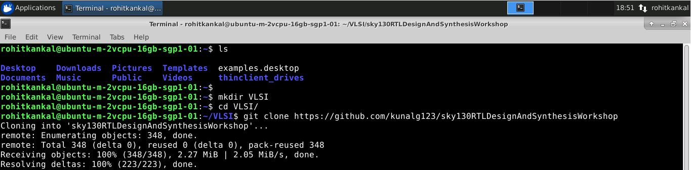

# Verilog RTL Design and Synthesis 
  Verilog is a popularly used Hardware Description Language. It is easy to learn and its similarity to C makes it programmer friendly. It is thus widely used, user friendly and powerful. However as Uncle Ben (Spiderman,Marvel Comics) quotes " With great power comes great responsibility",  the responsibility here for a Digital Design Engineer is to use this powerful tool of verilog to generate a proper  synthesizable hardware. This is where engineers like us miss in our early stages of our careers, we begin the design straight away and verify the behavior of RTL in  simulation without caring of the nitty gritty's and bad coding styles, only to discover that the synthesized hardware is either functionally not matching the expectation or timing issues pop up, apart from inefficient optimization. Thus, this increases debugging, the design time and thereby affects the time to market. This is where proper coding styles , design rules and guidelines, and understanding of synthesizer tool helps us to use this powerful EDA tool efficiently.This is the significance and use case of learning the synthesis tools, libraries and developing a methodology and design guidelines for generating efficient and optimized hardware at Register Transfer level.
  
# Table of Contents
  * [ Introduction to Verilog RTL design and Synthesis](https://github.com/iamrk-vlsi/RTL_Design_and_Synthesis_using_SKY130PDK_Yosys_iVerilog/blob/main/README.md#Introduction-to-Verilog-RTL-design-and-Synthesis)
- [Timing libs hierarchical vs flat synthesis and efficient flop coding styles](https://github.com/iamrk-vlsi/RTL_Design_and_Synthesis_using_SKY130PDK_Yosys_iVerilog/blob/main/README.md#Timing-libs-hierarchical-vs-flat-synthesis-and-efficient-flop-coding-styles)
- [Combinational and sequential optmizations](#Combinational-and-sequential-optmizations)
- [GLS blocking vs non blocking and Synthesis Simulation mismatch](https://github.com/iamrk-vlsi/RTL_Design_and_Synthesis_using_SKY130PDK_Yosys_iVerilog/blob/main/README.md#GLS-blocking-vs-non-blocking-and-Synthesis-Simulation-mismatch) 
- [If case for loop and for generate](https://github.com/iamrk-vlsi/RTL_Design_and_Synthesis_using_SKY130PDK_Yosys_iVerilog/blob/main/README.md#If-case-for-loop-and-for-generate)
- [Acknowledgements](https://github.com/iamrk-vlsi/RTL_Design_and_Synthesis_using_SKY130PDK_Yosys_iVerilog/blob/main/README.md#Acknowledgements)

# Introduction to Verilog RTL design and Synthesis
- We were introducted to concepts of RTL design, Testbench.
- Setup of Sky130 libraries and related toolchain.
- iVerilog and GTKwave were used as Simulator and graphic waveform simulation tools, respectively.
- Labs were done , which can be found [here](https://github.com/iamrk-vlsi/RTL_Design_and_Synthesis_using_SKY130PDK_Yosys_iVerilog/tree/main/D1/Labs)

# Timing libs, hierarchical vs flat synthesis and efficient flop coding styles  
- We explored the library files of Sky130.
- Synthesis of an RTL in hierarchy as well as flattening was observed, using Yosys.
- Learnt about the importance of flip flop an its efficient coding styles in with sync and async set/resets.
- Labs were done , which can be found [here](https://github.com/iamrk-vlsi/RTL_Design_and_Synthesis_using_SKY130PDK_Yosys_iVerilog/tree/main/D2/Labs)
# Combinational and sequential optmizations
- learnt about optimization theory and optimization command opt_clean -purge for Yosys
- Combinational circuits and how to optimize them, some good examples of Mux.
- Sequential circuits, optimizations in dff, counters and some multiplier logics.
- Labs were done , which can be found [here](https://github.com/iamrk-vlsi/RTL_Design_and_Synthesis_using_SKY130PDK_Yosys_iVerilog/tree/main/D3/Labs)
# GLS, blocking vs non-blocking and Synthesis-Simulation mismatch
- Gate Level simulation and its significance.
- Blocking(used primarily for combinational logic) and Nonblocking statements(used primarily for sequential logic).
- Synthesis and Simulations mismatch in combinational logic, particularly in Muxes.
- Inferring of unwanted Latches during simulation due to improper sensitivity list,etc.
- Labs were done , which can be found [here](https://github.com/iamrk-vlsi/RTL_Design_and_Synthesis_using_SKY130PDK_Yosys_iVerilog/tree/main/D4/Labs)
# If, case, for loop and for generate
- Verilog constructs mentioned above were studied
- Caveats in If and case due to incomplete assignments were observed
- Importance of for loop for multiple evaluation and for generate for multiple instantiation.
- Labs were done , which can be found [here](https://github.com/iamrk-vlsi/RTL_Design_and_Synthesis_using_SKY130PDK_Yosys_iVerilog/tree/main/D5/Labs)
# Acknowledgements
- [Kunal Ghosh](https://github.com/kunalg123), Co-founder (VSD Corp. Pvt. Ltd)
- [Shon Taware](https://github.com/ShonTaware), Intern (Chipspirit)
